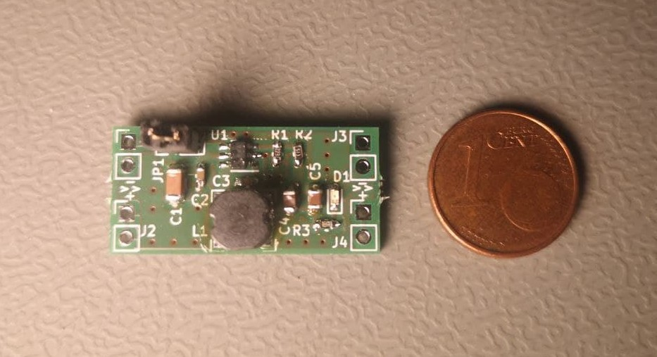

= Schematic for a switch mode power supply

Goal:

* small switch mode power supply
* convert battery voltages in the range of 9 to 30 Volts down to 3.3 Volts
* Support 1A or above

== IC LMR50410

.PCB Foto

* New IC
* Up to 1A
* Input 4V to 36V
* EMI improved
* STO-23-6 Package

See link:schematic_LMR50410/README.adoc[the schematic_LMR50410 folder] for the schematic and pictures.

== IC LMR33630

* Alternative to LM2576
* Up to 3A
* 4V to 36V
* Ultra low EMI
* HSOIC 8 pin package

Datasheet:
https://www.ti.com/product/LMR33630?HQS=ds-snvs107-lmr33630-feat-pf-en#product-details##pps

== KiCad Tools

=== KiField

Bulk edit fields of parts from a schematic or a library

https://xess.com/KiField/docs/_build/singlehtml/index.html

[source,bash]
----
pip install kifield
----

[source,bash]
----
               [--recurse] [--fields name|/name|~name [name|/name|~name ...]]
               [--overwrite] [--nobackup] [--group] [--debug [LEVEL]]
               [--version]

Insert fields from spreadsheets into KiCad schematics or libraries, or gather
fields from schematics or libraries and place them into a spreadsheet.

optional arguments:
  -h, --help            show this help message and exit
  --extract file [file ...], -x file [file ...]
                        Extract field values from one or more XLSX, CSV, TSV,
                        SCH, LIB or DCM files.
  --insert file [file ...], -i file [file ...]
                        Insert field values into one or more XLSX, CSV, TSV,
                        SCH, LIB or DCM files.
  --recurse, -r         Allow recursion from a top-level schematic into lower-
                        level sub-schematics.
  --fields name|/name|~name [name|/name|~name ...], -f name|/name|~name [name|/name|~name ...]
                        Specify the names of the fields to extract and insert.
                        Place a '/' or '~' in front of a field you wish to
                        omit. (Leave blank to extract/insert *all* fields.)
  --overwrite, -w       Allow field insertion into an existing file.
  --nobackup, -nb       Do *not* create backups before modifying files.
                        (Default is to make backup files.)
  --group, -g           Group components with the same field values into
                        single lines when inserting into a spreadsheet or
                        CSV/TSV. (Default is to have one component per line)
  --debug [LEVEL], -d [LEVEL]
                        Print debugging info. (Larger LEVEL means more info.)
  --version, -v         show program's version number and exit
----

==== Examples

To extract the fields from one or more schematics and place them in a CSV file:

[source,bash]
----
kifield -x my_design.sch -i my_design_fields.csv
----

Or you can place them in an XLSX spreadsheet:

[source,bash]
----
kifield -x my_design.sch -i my_Design_fields.xlsx
----
